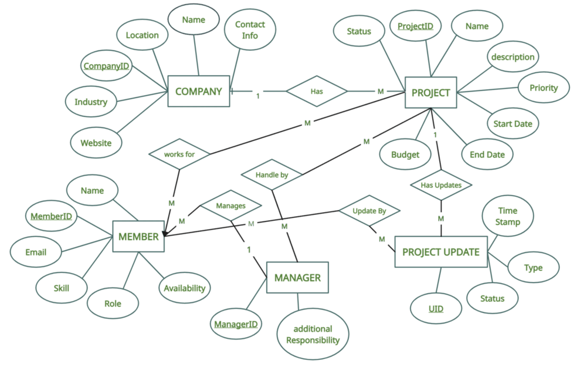

# Architecture Document

## 1. System Architecture Overview

The system follows a three-tier architecture consisting of a client layer, application layer, and data layer. Users interact with the system through a browser-based frontend application. The frontend communicates with the backend API server using RESTful HTTP requests secured by JWT authentication. The backend processes business logic and interacts with a PostgreSQL database for persistent storage.

Browser → Frontend → Backend → Database
          ↑           ↓
        JWT Token Authentication

---

## 2. Database Schema Design

The database is designed using a shared database and shared schema multi-tenancy model. Each tenant's data is isolated using a tenant_id column in all tenant-specific tables. Foreign key constraints ensure data integrity, and indexes on tenant_id improve query performance.

---
## 3. API Architecture

### Authentication Module

| Method | Endpoint                    | Authentication Required | Allowed Role |
| -----: | --------------------------- | ----------------------- | ------------ |
|   POST | `/api/auth/register-tenant` | No                      | Public       |
|   POST | `/api/auth/login`           | No                      | Public       |
|    GET | `/api/auth/me`              | Yes (JWT)               | All Roles    |
|   POST | `/api/auth/logout`          | Yes (JWT)               | All Roles    |

---

### Tenant Management Module

| Method | Endpoint                 | Authentication Required | Allowed Role               |
| -----: | ------------------------ | ----------------------- | -------------------------- |
|    GET | `/api/tenants/:tenantId` | Yes (JWT)               | Tenant Admin / Super Admin |
|    PUT | `/api/tenants/:tenantId` | Yes (JWT)               | Tenant Admin / Super Admin |
|    GET | `/api/tenants`           | Yes (JWT)               | Super Admin                |

---

### User Management Module

| Method | Endpoint                       | Authentication Required | Allowed Role        |
| -----: | ------------------------------ | ----------------------- | ------------------- |
|   POST | `/api/tenants/:tenantId/users` | Yes (JWT)               | Tenant Admin        |
|    GET | `/api/tenants/:tenantId/users` | Yes (JWT)               | Tenant Users        |
|    PUT | `/api/users/:userId`           | Yes (JWT)               | Tenant Admin / Self |
| DELETE | `/api/users/:userId`           | Yes (JWT)               | Tenant Admin        |

---

### Project Management Module

| Method | Endpoint                   | Authentication Required | Allowed Role           |
| -----: | -------------------------- | ----------------------- | ---------------------- |
|   POST | `/api/projects`            | Yes (JWT)               | Tenant Users           |
|    GET | `/api/projects`            | Yes (JWT)               | Tenant Users           |
|    PUT | `/api/projects/:projectId` | Yes (JWT)               | Tenant Admin / Creator |
| DELETE | `/api/projects/:projectId` | Yes (JWT)               | Tenant Admin / Creator |

---

### Task Management Module

| Method | Endpoint                         | Authentication Required | Allowed Role |
| -----: | -------------------------------- | ----------------------- | ------------ |
|   POST | `/api/projects/:projectId/tasks` | Yes (JWT)               | Tenant Users |
|    GET | `/api/projects/:projectId/tasks` | Yes (JWT)               | Tenant Users |
|    PUT | `/api/tasks/:taskId`             | Yes (JWT)               | Tenant Users |
|  PATCH | `/api/tasks/:taskId/status`      | Yes (JWT)               | Tenant Users |

---